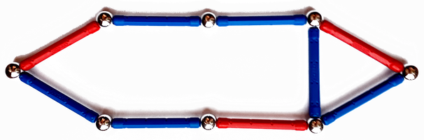
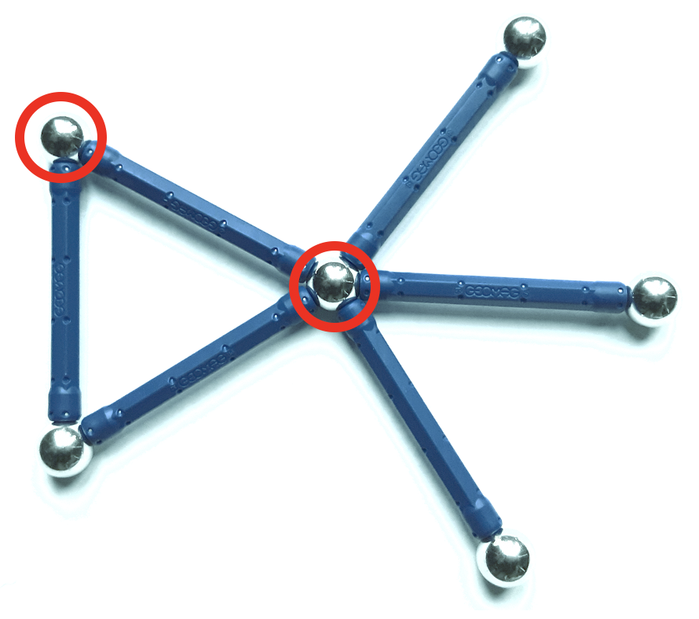

.. _covering:

*********
Covering
*********

Covering problems in graphs are about finding substructures in a graph to which all other elements of the graph are adjacent. For example, in a vertex cover we look for a subset of the vertex set containing at least one end-point of each edge and hence covering all edges.

Dominating set
==============
A `dominating set <https://en.wikipedia.org/wiki/Dominating_set>`_ in a graph :math:`G = (V, E)` is a subset :math:`S \subset V` of the vertex set such that each vertex :math:`v \in V` is connected to a vertex :math:`s \in S` by an edge :math:`\{s,v\} \in E`. 

.. tikz:: A minimum dominating set (red vertices) of the Petersen graph.
   :align: center
   
   \tikzset{main node/.style={circle,draw,font=\sffamily\bfseries}}
   \tikzset{scale=0.5}

   \node[main node,fill=red!50] (1) at (4, 0) {};
   \node[main node,fill=blue!50] (2) at (1.236, 3.8) {};
   \node[main node,fill=red!50] (3) at (-3.236, 2.351) {};
   \node[main node,fill=blue!50] (4) at (-3.236, -2.351) {};
   \node[main node,fill=blue!50] (5) at (1.236, -3.8) {};

   \node[main node,fill=blue!50] (6) at (2.0, 0.0) {};
   \node[main node,fill=red!50] (7) at (0.618, 1.902) {};
   \node[main node,fill=blue!50] (8) at (-1.618, 1.176) {};
   \node[main node,fill=blue!50] (9) at (-1.618, -1.176) {};
   \node[main node,fill=blue!50] (10) at (0.618, -1.902) {};

   \path[every node/.style={font=\sffamily\small}]
   (1) edge (2) edge (6) 
   (2) edge (3) edge (7)
   (3) edge (4) edge (8)
   (4) edge (5) edge (9)
   (5) edge (1) edge (10)
   (6) edge (8)
   (7) edge (9)
   (8) edge (10)
   (9) edge (6)
   (10) edge (7);

.. automodule:: graphilp.covering.min_dom_set
   :noindex:

.. autosummary::
   :nosignatures:
   
   create_model
   extract_solution

Edge dominating set
===================

An `edge dominating set <https://en.wikipedia.org/wiki/Edge_dominating_set>`_ in a graph :math:`G = (V, E)` is a subset :math:`S \subseteq E` of the edge set such that each edge in :math:`E` is adjacent to an edge in :math:`S`.

.. automodule:: graphilp.covering.min_edge_dom
   :noindex:

.. autosummary::
   :nosignatures:
   
   create_model
   extract_solution

Vertex cover
============

A `vertex cover <https://en.wikipedia.org/wiki/Vertex_cover>`_ in a graph :math:`G = (V, E)` is a subset :math:`S \subset V` of the vertex set such that for each edge :math:`\{u, v\} \in E` at least one of its vertices is in :math:`S`: :math:`\{u,v\} \cap S \neq \emptyset`. 

.. automodule:: graphilp.covering.min_vertexcover
   :noindex:

.. autosummary::
   :nosignatures:
   
   create_model
   extract_solution
   
Heuristics
----------

The methods in this section provide approximate solutions to the vertex cover problem constituting admissible solutions from which to start the exact optimisation.

.. automodule:: graphilp.covering.heuristics.vertexcover_maximal_matching
   :noindex:

.. autosummary::
   :nosignatures:

   get_heuristic

.. automodule:: graphilp.covering.heuristics.vertexcover_lp_rounding
   :noindex:

.. autosummary::
   :nosignatures:

   get_heuristic

Knapsack
========

In the `multi-dimensional knapsack problem <https://en.wikipedia.org/wiki/Knapsack_problem#Multi-dimensional_knapsack_problem>`__
the goal is to pack items with the highest total value into a knapsack where each item has a multi-dimensional weight vector and the knapsack has an individual capacity that cannot be exceeded in each dimension of the weight vector.

.. automodule:: graphilp.covering.knapsack
   :noindex:

.. autosummary::
   :nosignatures:
   
   create_model
   extract_solution
   
k-Cover
=======

In the k-cover problem, the elements of the universe of a set system are to be covered by at most k sets of the system.
The objective is then to maximise the total weight of the elements that are covered.

.. automodule:: graphilp.covering.k_cover
   :noindex:

.. autosummary::
   :nosignatures:
   
   create_model
   extract_solution

Set cover
=========

The `set cover problem <https://en.wikipedia.org/wiki/Set_cover_problem>`__ is to find the smallest weight sub-collection of the sets in a set system such that all elements of the underlying universe are covered.

.. automodule:: graphilp.covering.set_cover
   :noindex:

.. autosummary::
   :nosignatures:
   
   create_model
   extract_solution
   
Heuristics
----------

The methods in this section provide approximate solutions to the set cover problem constituting admissible solutions from which to start the exact optimisation.

.. automodule:: graphilp.covering.heuristics.setcover_greedy
   :noindex:

.. autosummary::
   :nosignatures:

   get_heuristic   

Details
=======

.. automodule:: graphilp.covering.min_dom_set
  :members:
  
.. automodule:: graphilp.covering.min_edge_dom
  :members:  
  
.. automodule:: graphilp.covering.min_vertexcover
  :members:    
  
.. automodule:: graphilp.covering.heuristics.vertexcover_maximal_matching
  :members:      
  
.. automodule:: graphilp.covering.heuristics.vertexcover_lp_rounding
  :members:      
  
.. automodule:: graphilp.covering.knapsack
  :members:      
   
.. automodule:: graphilp.covering.k_cover
  :members:      

.. automodule:: graphilp.covering.set_cover
  :members: 
  
.. automodule:: graphilp.covering.heuristics.setcover_greedy
  :members:  