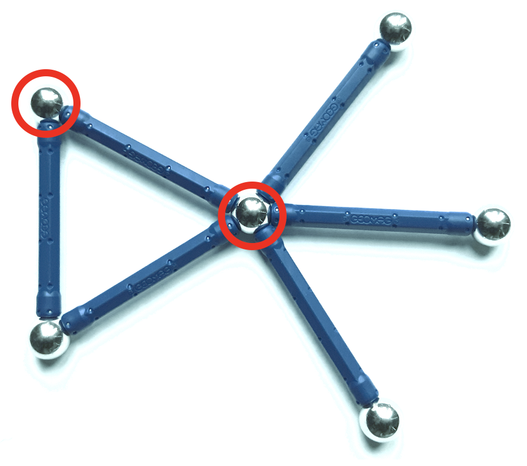

.. _covering:

*********
Covering
*********

Covering problems in graphs ask for substructures in the graph such that all other elements of the graph are adjacent to this substructure. For example, in a minimal vertex cover we look for a subset of the vertex set such that all other vertices are connected to the selected ones by an edge.

Dominating set
-------------------
A `dominating set <https://en.wikipedia.org/wiki/Dominating_set>`_ in a graph :math:`G = (V, E)` is a subset :math:`S \subset V` of the vertex set such that each vertex :math:`v \in V` is connected to a vertex :math:`s \in S` by an edge :math:`\{s,v\} \in E`. 

.. automodule:: graphilp.covering.min_dom_set
   :noindex:

.. autosummary::
   :nosignatures:
   
   createModel
   extractSolution

Edge dominating set
-------------------

An `edge dominating set <https://en.wikipedia.org/wiki/Edge_dominating_set>`_ in a graph :math:`G = (V, E)` is a subset :math:`S \subset E` of the edge set such that each edge in :math:`E` is adjacent to an edge in :math:`S`.

.. automodule:: graphilp.covering.min_edge_dom
   :noindex:

.. autosummary::
   :nosignatures:
   
   createModel
   extractSolution

Vertex cover
------------

A `vertex cover <https://en.wikipedia.org/wiki/Vertex_cover>`_ in a graph :math:`G = (V, E)` is a subset :math:`S \subset V` of the vertex set such that each edge :math:`\{u, v\} \in E` at least one of its vertices is in :math:`S`: :math:`\{u,v\} \cap S \neq \emptyset`. 

.. automodule:: graphilp.covering.min_vertexcover
   :noindex:

.. autosummary::
   :nosignatures:
   
   createModel
   createModelWeighted
   extractSolution
   
Warmstarts
==========
.. automodule:: graphilp.covering.warmstart_vertex_covering
   :noindex:

.. autosummary::
   :nosignatures:

   createApproximation

Details
------------

.. automodule:: graphilp.covering.min_dom_set
  :members:
  
.. automodule:: graphilp.covering.min_edge_dom
  :members:  
  
.. automodule:: graphilp.covering.min_vertexcover
  :members:    
  
.. automodule:: graphilp.covering.warmstart_vertex_covering
  :members:      