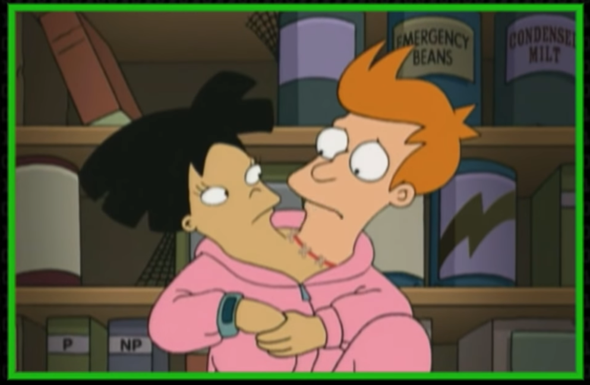

.. GraphILP documentation master file, created by
   sphinx-quickstart on Wed Apr 22 15:50:23 2020.
   You can adapt this file completely to your liking, but it should at least
   contain the root `toctree` directive.

Welcome to GraphILP's documentation!
====================================

This package implements ILP-formulations of NP-hard problems on graphs.

.. toctree::
   :maxdepth: 2
   :caption: Contents:

ILPGraph
=========

An ILPGraph is the base of all ILP implementations and  consists of a networkx graph object and holds attributes required for the ILP-formulation of specific problems, e.g., Gurobi decision variables.

.. automodule:: imports.ilpgraph

Parse and Read Utilities
----------------------------
.. automodule:: imports.networkx
  :members:

Matching
=========

Partitioning
=============

Minimum Vertex Coloring
------------------------

.. automodule:: partitioning.min_vertex_coloring
  :members:

Indices and tables
==================

* :ref:`genindex`
* :ref:`modindex`
* :ref:`search`
