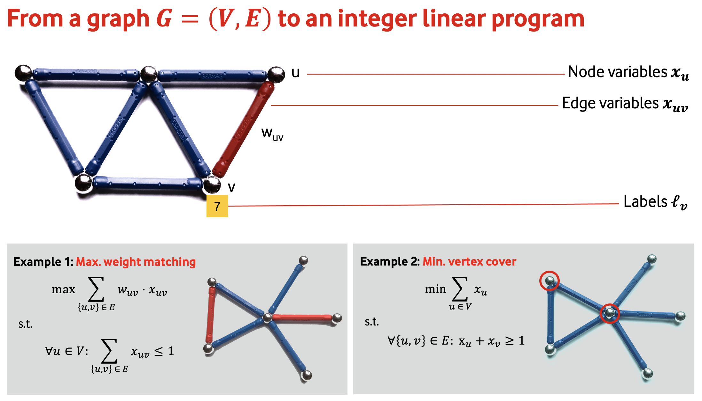

.. _introduction:

*************
Introduction
*************

Many optimisation problems on graphs can be solved by `integer linear programming <https://en.wikipedia.org/wiki/Integer_programming>`_. The following sketch gives an overview of a general approach for translating graph problems to integer linear programs:

GraphILP aims at providing ILP formulations for many graph problems and making them easy to use.
The general idea is to input a graph, select an optimisation problem, and run an optimiser on it.

We are currently supporting `Gurobi <https://www.gurobi.com>`_ as an underlying ILP solver and interfacing through its Python API.

Examples
--------
The best way to get startet with GraphILP is through one of our examples:

.. list-table:: List of examples
   :widths: 50 50
   :header-rows: 0

   * - .. image:: example_bipartite.png
     - `Two-coloured partitions <https://github.com/VF-DE-CDS/GraphILP-API/blob/develop/graphilp/examples/2-coloured%20partitions.ipynb>`_
     
       Learn how to use perfect matching in bipartite graphs to find a way 
       
       to connect n random blue points in the plane to n random orange points without crossings.
   * - .. image:: example_mapcolouring.png
     - `Map colouring <https://github.com/VF-DE-CDS/GraphILP-API/blob/develop/graphilp/examples/Map%20colouring.ipynb>`_
     
       Colour a map with as few colours as possible such that 
       
       no two adjacent areas get the same colour.
   * - .. image:: example_steiner.png
     - `Steiner trees <https://github.com/VF-DE-CDS/GraphILP-API/blob/develop/graphilp/examples/SteinerTreesOnStreetmap.ipynb>`_
     
       Find the shortest tree connecting a given set of nodes in a graph.
   * - .. image:: example_vertexcolour.png
     - `Minimum vertex cover <https://github.com/VF-DE-CDS/GraphILP-API/blob/develop/graphilp/examples/min_vertex_coloring_example.ipynb>`_
     
       A simple example finding the minimal number of colours needed
       
       to colour circle graphs such that neighbouring nodes get different colours.
