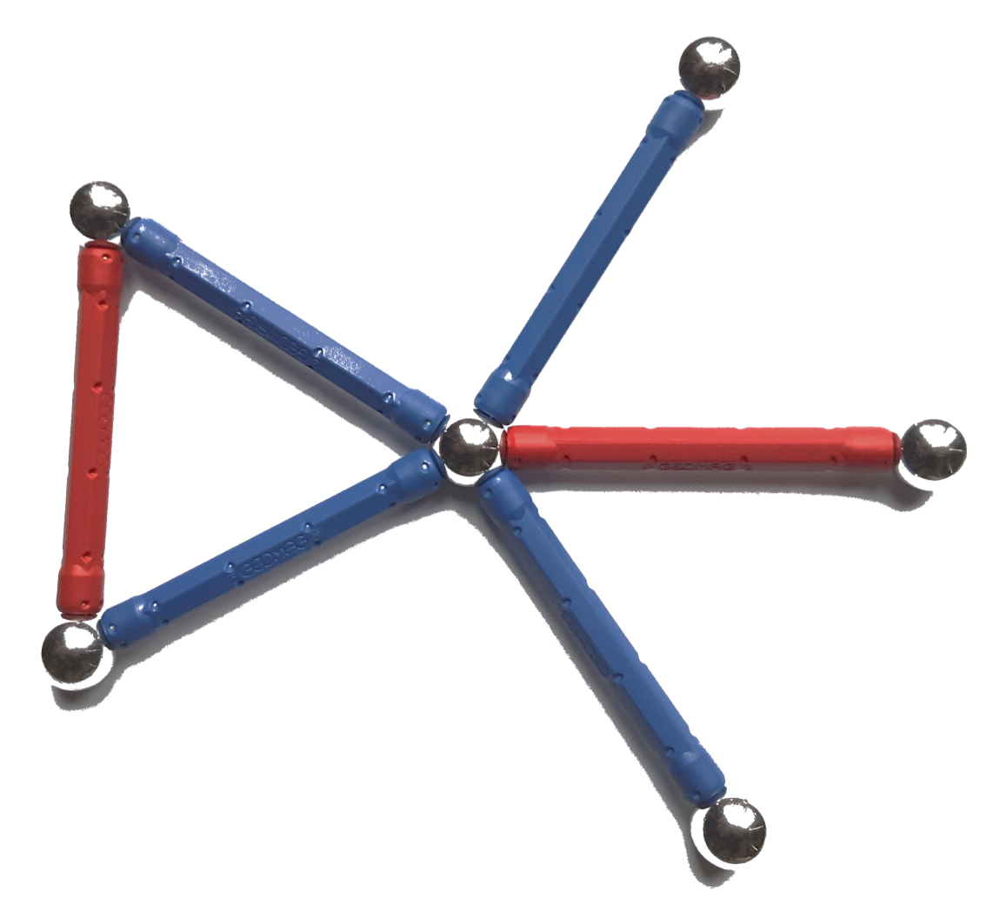

.. _matching:

*********
Matching
*********

A `matching <https://en.wikipedia.org/wiki/Matching_(graph_theory)>`__ in a graph :math:`G = (V, E)` is a subset :math:`S \subset E` of edges in which no pair of edges shares a vertex.

    
There are numerous natural optimisation questions on matchings, e.g., looking for perfect matchings (covering all vertices), maximal matchings (those that cannot be extended to a larger matching), maximum matchings (maximum cardinality), matching for certain classes of graphs, and matchings that optimise the weights of the edges involved in the matching.

An extensive discussion of matchings can be found in

* Lovász, Plummer: `Matching Theory <https://www.ams.org/publications/authors/books/postpub/chel-367>`__.

General matching
================

.. automodule:: graphilp.matching.maxweight
   :noindex:

.. autosummary::
   :nosignatures:
   
   create_model
   extract_solution
   
Perfect matching
================

A `perfect matching <https://en.wikipedia.org/wiki/Perfect_matching>`__ in a graph is a matching in which each vertex of the graph is covered by an edge of the matching.

.. automodule:: graphilp.matching.perfect
   :noindex:

.. autosummary::
   :nosignatures:
   
   create_model
   extract_solution

Bipartite matching
==================

For `bipartite <https://en.wikipedia.org/wiki/Bipartite_graph>`__ graphs, matching is usually much easier than for general graphs. The natural ILP for bipartite perfect matching is in fact a linear program: the integrality constraints are fulfilled automatically.

.. automodule:: graphilp.matching.perfect_bipartite
   :noindex:

.. autosummary::
   :nosignatures:
   
   create_model
   extract_solution

Details
=======

.. automodule:: graphilp.matching.maxweight
   :members:

.. automodule:: graphilp.matching.perfect
   :members:

.. automodule:: graphilp.matching.perfect_bipartite
   :members: